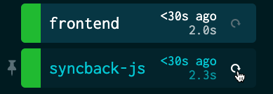

# Syncback

This extension helps you sync files/directories from your container back to your local FS. Under the hood, it uses [`rsync`](https://rsync.samba.org/) to be smart about what files to transfer. For details on implementation, gotchas, etc., see [MORE_INFO.md](MORE_INFO.md).

## Overview
This extension provides a function `syncback` which creates a manually-triggered local resource to sync files from a Kubernetes container back to your local filesystem. You can configure the source pod/container/directory/files+directories, and the destination location, as well as some other settings.

Whenever you want to sync files back from the pod to your local filesystem, invoke the local resource from the Web UI:



You can also use the [`tilt trigger` CLI](https://docs.tilt.dev/cli/tilt_trigger.html); e.g. for the example above, you would run:
```
tilt trigger syncback-js
```

## Usage
First, **make sure you have an up-to-date `rsync` on your local machine** (version >= 3.0.0).

Import this extension by putting the following at the top of your Tiltfile:
```
load('ext://syncback', 'syncback')
```

For every syncback resource you want to create, invoke `syncback` with the following parameters:

* **name (str)**: name of the created local resource
* **k8s_object (str)**: a Kubernetes object identifier (e.g. `deploy/my-deploy`, `job/my-job`, or a pod ID) that Tilt can use to select a pod. As per the behavior of `kubectl exec`, we will act on the first pod of the specified object, using the first container by default
* **src_dir (str)**: directory *in the remote container* to sync from. Any `paths`, if specified, should be relative to this dir. This path *must* be a directory and must contain a trailing slash (e.g. `/app/` is acceptable; `/app` is not)

You may also pass the following optional parameters:
* **paths (List[str], optional)**: paths *in the remote container* to sync, relative to `src_dir`. May be files or directories. Note that these must not begin with `./`. If no paths are provided, we sync the entire `src_dir`
* **target_dir (str, optional)**: directory *on the local filesystem* to sync to. Defaults to `'.'`
* **container (str, optiona)**: name of the container to sync from (by default, the first container)
* **namespace (str, optiona)**: namespace of the desired `k8s_object`, if not `default`.
* **verbose (bool, optional)**: if true, print additional rsync information.

### Example invocations:
1. Create a local resource called "syncback-js" which connects to the first pod of "deploy/frontend" (and the default container) and syncs "/app/package.json" and "/app/yarn.lock" to local directory "./frontend".
    ```python
    syncback('syncback-js', 'deploy/frontend', '/app/',
             target_dir='./frontend',
             paths=['package.json', 'yarn.lock']
    )
    ```

2. Create a local resource called "syncback-portal" which connects to the first pod of "deploy/portal-app" (to container "app") in namespace $(whoami), and syncs the entire contents of "src/node_modules" to local directory "./portal/node_modules".
    ```python
    ns = str(local('whoami')).strip()
    syncback('syncback-portal', 'deploy/portal-app', '/src/node_modules/',
             target_dir='./portal/node_modules',
             container='app',
             namespace=ns
    )
    ```

3. Create a local resource called "syncback-data" which connects to the first pod of "job/data-cron" syncs the contents of "/data" to "."
    ```python
    syncback('syncback-data', 'job/data-cron', '/data/')
    ```

You can create as many syncback resources as you like; you'll need at minimum one syncback resource for every remote container you want to copy from, but you might choose to have different syncback resources for different sets of files, e.g. one to copy back `node_modules` and one to copy back your `data/` directory.

### Gotchas
#### Tilt updates my pod after a syncback
This is expected behavior; if you're using [Live Update](https://docs.tilt.dev/live_update_tutorial.html), we expect the update that runs after syncback to be a no-op, and super fast. For more on how to how to make this extra update as painless as possible, see [MORE_INFO.md](MORE_INFO.md).

### Syncback isn't finding the files I expect it to
Kubernetes might have connected you to the wrong pod. We recommend waiting a few seconds/waiting until `kubectl get pods` shows only the pods you expect to, and trying again. For details, see [MORE_INFO.md](MORE_INFO.md).


### Unsupported/Future Work
(Need this functionality? Need something else not listed here? [Let us know](https://github.com/tilt-dev/tilt-extensions/issues)!)
* specifying excludes: right now you can specify files to include, but not files to exclude)
* `rsync`-specific syntax: `rsync` has its own semantics, e.g. specific meanings for directories with and without a trailing slash, or for `*` vs. `**` vs. `***`. This extension converts your arguments into our best guess of their `rsync` translation, but `rsync` experts might want more fine-grained control
* running on Windows containers: our pre-built Linux `rsync` binary definitely won't run on Windows containers
* running automatically in response to file/resource changes: it would be neat if Tilt knew when syncbacks were needed (because `fileX` changed locally, because Resource Y updated, or even if `fileZ` changed in the container), but currently this isn't supported

## For Maintainers: Updating `rsync` Binary
tk

[^1]: https://www.digitalocean.com/community/tutorials/how-to-use-rsync-to-sync-local-and-remote-directories
